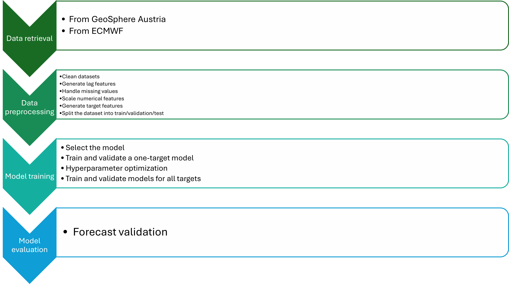

# Subseasonal Forecasts of Minimum-, Maximum-, and Mean Daily Temperatures for Austrian Locations

## Project Overview

This project focuses on improving subseasonal temperature forecasting by predicting daily minimum, maximum, and mean temperatures for Austrian locations.

The project uses ECMWF model forecasts, station data from Austrian meteorology sites, and machine learning. Model performance is evaluated using statistical metrics such as RMSE (Root Mean Square Error) and MAE (Mean Absolute Error).

## Data Sources

* ECMWF Subseasonal Forecast Data: [ECMWF Dataset](https://apps.ecmwf.int/datasets/data/s2s/levtype=sfc/type=cf/)

* Austrian Station Data: [Geosphere Data Hub](https://data.hub.geosphere.at/dataset/klima-v2-1d)

## Workflow

  

## Results & Performance

Model outputs are stored in results/.

Visualizations and evaluation metrics are saved in results/validation_plots/.

## Contact

*Mariia Khokhlova*

*University of Vienna, MSc Computer Science*

