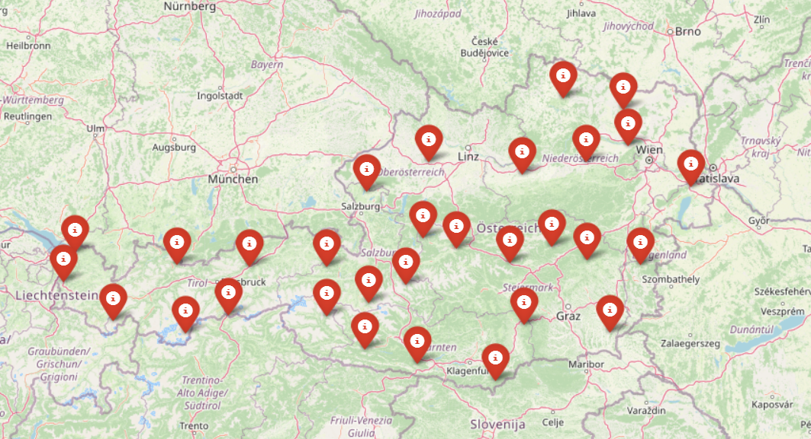
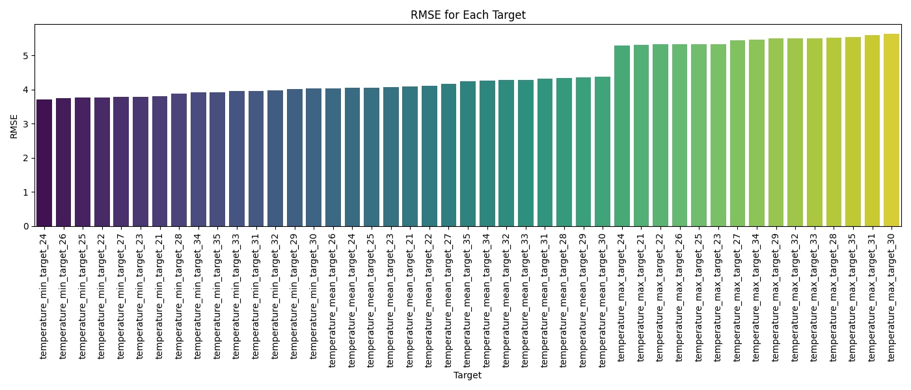
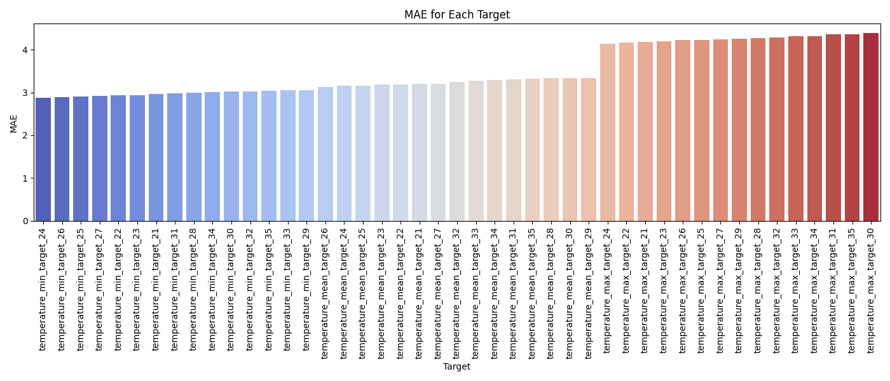
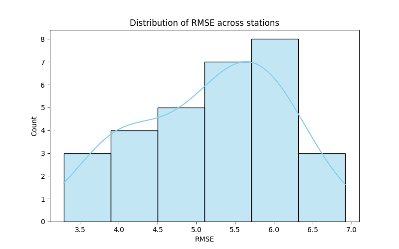
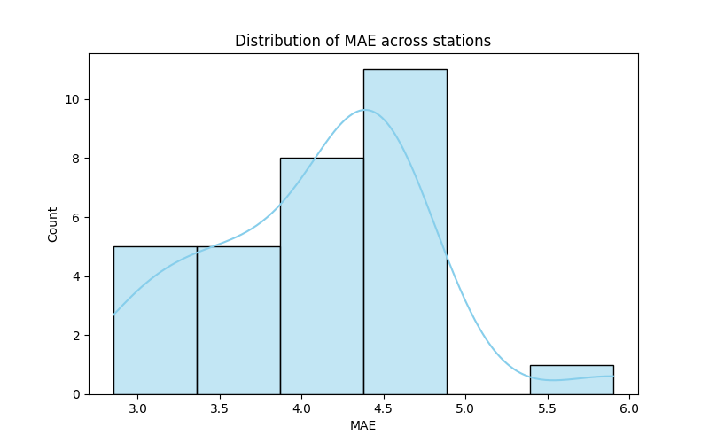
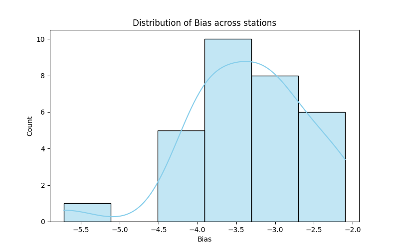
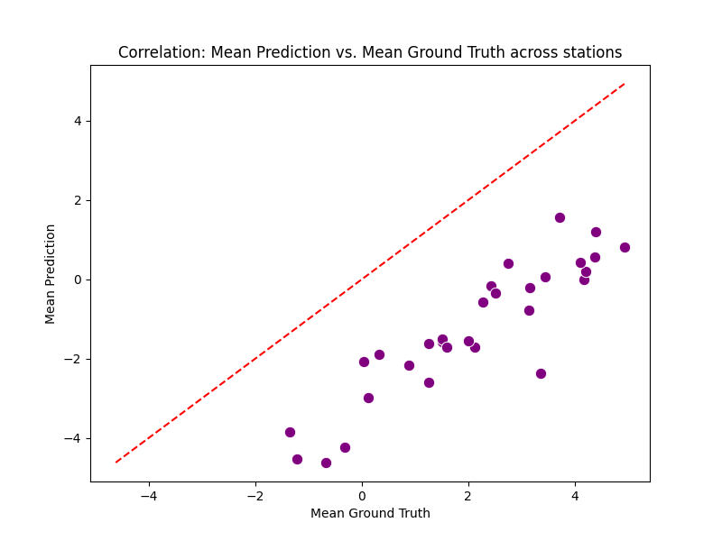
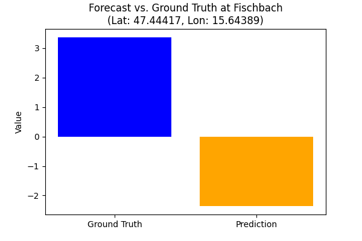
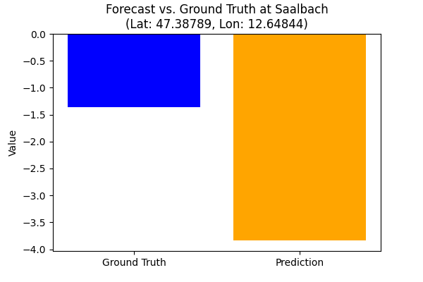

# Subseasonal Forecasts of Minimum-, Maximum-, and Mean Daily Temperatures for Austrian Locations

## Project Overview

This project focuses on improving subseasonal temperature forecasting by predicting daily minimum, maximum, and mean temperatures for Austrian locations.

The project uses ECMWF model forecasts, station data from Austrian meteorology sites, and machine learning. Model performance is evaluated using statistical metrics such as RMSE (Root Mean Square Error) and MAE (Mean Absolute Error).

## Data Sources

* ECMWF Subseasonal Forecast Data: [ECMWF Dataset](https://apps.ecmwf.int/datasets/data/s2s/levtype=sfc/type=cf/)

* Austrian Station Data: [Geosphere Data Hub](https://data.hub.geosphere.at/dataset/klima-v2-1d)

## Workflow

## Selected Austrian locations

  
## Repository structure:
### 1. Data
This folder contains all the raw and processed datasets used in the project.

* distributed_stations.csv - selected Austrian stations.
* geosphere_data.csv - meteorological data from Geosphere Austria.
* parameters.csv - metadata from GeoSphere Austria.
* subseasonal_output.grib - raw ECMWF subseasonal forecast data.
* subseasonal_output.grib.5b7b6.idx - index file for the GRIB dataset.

## 2. Notebooks
Jupyter notebooks used for different stages of data processing, model training, and evaluation.

* data_retrieval.ipynb - retrieving data from data sources.
* ECMWF.ipynb - processes ECMWF raw forecasts.
* evaluation.ipynb - computes validation metrics (RMSE, MAE, bias) and provides validation plots.
* model_training.ipynb - implements machine learning models (LightGBM).
* preprocessing.ipynb - cleans and prepares data for training.
* station_selection.ipynb - selects key meteorological stations.

## 3. Results
This folder contains model outputs and evaluations.

## 4. How to run the notebooks
Prerequisites:
* Python 3.x
* Jupyter Notebook

## Contact

*Mariia Khokhlova*

*University of Vienna, MSc Computer Science*
